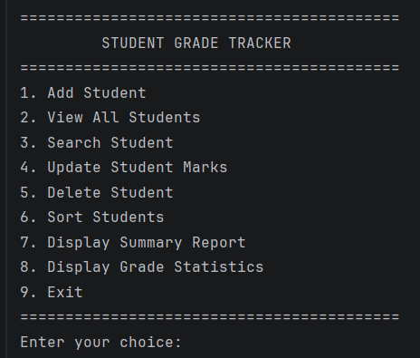
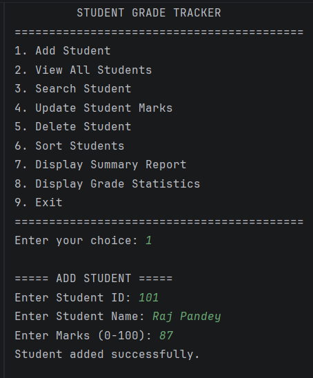
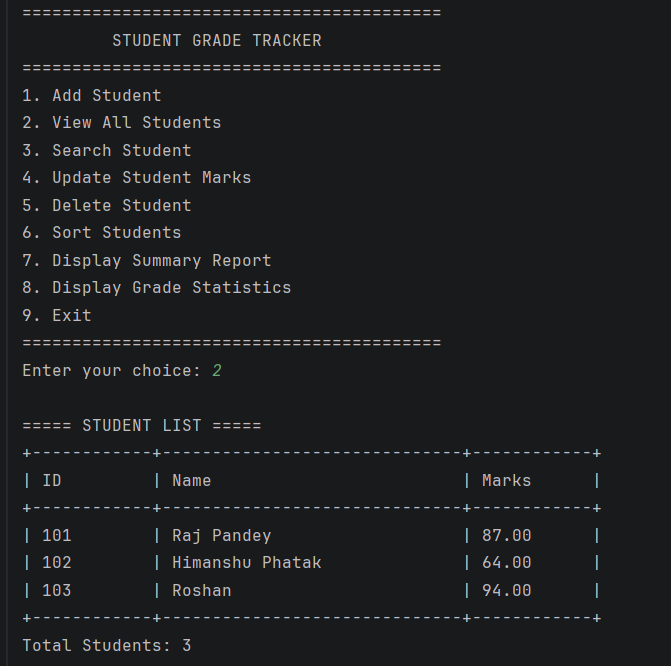
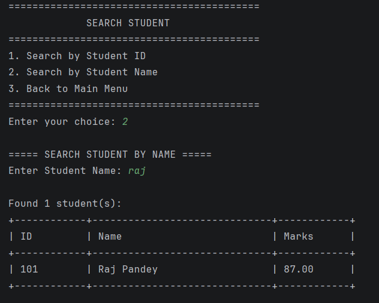
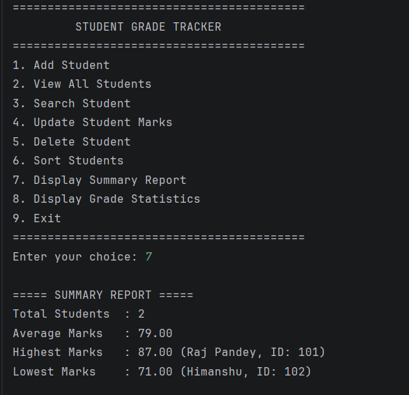
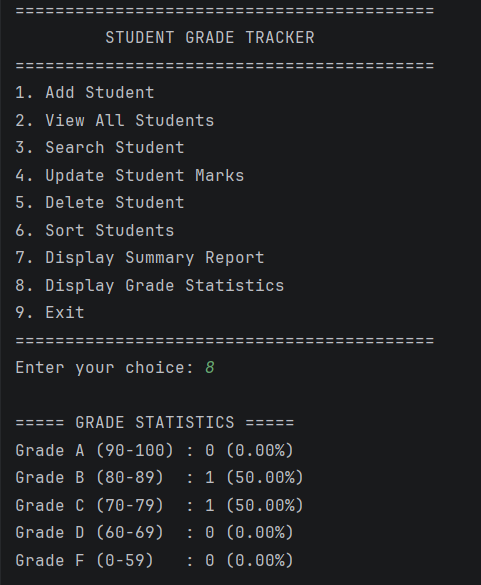

# 🎓 Student Grade Tracker

A Java console-based application designed to efficiently manage student records and academic performance. The application allows users to add, view, search, update, delete, and sort student records while automatically calculating grades and generating detailed summary reports.

This project was developed as part of my **Java Programming Internship at CodeAlpha** and demonstrates the practical implementation of Core Java concepts, Object-Oriented Programming (OOP), Collections, Exception Handling, and Input Validation.

---

## ✨ Features

### 👨‍🎓 Student Management
- ➕ Add new student records
- 📋 View all students
- 🔍 Search students by unique Student ID
- 🔎 Search students by name
- 🔤 Partial and case-insensitive name search
- ✏️ Update student marks using Student ID
- 🗑️ Delete student records using Student ID

### 📊 Grade Management
- 🎯 Automatic grade calculation based on marks
- ✅ Pass/Fail result calculation
- 📈 Display grade-wise statistics
- 📊 Generate detailed student performance summary

### 🔃 Sorting
- 🔤 Sort students by name (A-Z)
- 📉 Sort students by marks (Highest to Lowest)

### 📑 Summary Report
The application generates a detailed summary containing:

- Total number of students
- Average marks
- Highest scoring student
- Lowest scoring student
- Pass percentage
- Grade-wise student statistics

### 🛡️ Input Validation
- Prevents invalid menu input
- Validates Student ID
- Validates marks between `0` and `100`
- Handles invalid numeric input
- Prevents duplicate Student IDs
- Prevents empty student names

---

## 🛠️ Technologies Used

- **Java**
- **Object-Oriented Programming (OOP)**
- **Java Collections Framework**
- **ArrayList**
- **Comparator**
- **Scanner Class**
- **Exception Handling**
- **Lambda Expressions**
- **Git & GitHub**
- **IntelliJ IDEA**

---

## 📂 Project Structure

```text
CodeAlpha_StudentGradeTracker/
│
├── src/
│   ├── Student.java
│   ├── StudentManager.java
│   └── StudentGradeTracker.java
│
├── .gitignore
└── README.md
```

### File Description

| File | Description |
|------|-------------|
| `Student.java` | Represents a student and stores Student ID, name, marks, grade, and result information. |
| `StudentManager.java` | Contains the main business logic for managing, searching, updating, deleting, sorting, and analyzing student records. |
| `StudentGradeTracker.java` | Contains the main method and provides the menu-driven console interface. |

---

## 🧠 Java Concepts Implemented

This project demonstrates several important Core Java concepts:

- Classes and Objects
- Encapsulation
- Constructors
- Getters and Setters
- Method Overriding
- Static Methods and Variables
- ArrayList
- Collections
- Comparator
- Loops and Conditional Statements
- Exception Handling
- Input Validation
- Lambda Expressions

---

## 🚀 How to Run the Project

### 1. Clone the Repository

```bash
git clone https://github.com/rajpandey4706/CodeAlpha_StudentGradeTracker.git
```

### 2. Open the Project

Open the cloned project using:

- IntelliJ IDEA
- Eclipse
- VS Code with Java extensions

### 3. Navigate to the Source Folder

```bash
cd src
```

### 4. Compile the Java Files

```bash
javac Student.java StudentManager.java StudentGradeTracker.java
```

### 5. Run the Application

```bash
java StudentGradeTracker
```

---

## 🖥️ Application Menu

```text
==========================================
         STUDENT GRADE TRACKER
==========================================
1. Add Student
2. View All Students
3. Search Student
4. Update Student Marks
5. Delete Student
6. Sort Students
7. Display Summary Report
8. Display Grade Statistics
9. Exit
==========================================
Enter your choice:
```

---

## 🔍 Search Functionality

The application provides two ways to search for students:

### Search by Student ID

Each student is identified using a unique Student ID.

```text
Enter Student ID: 1001
```

### Search by Student Name

The name search supports **partial and case-insensitive searching**.

For example, if the student's name is:

```text
Raj Pandey
```

The student can be found using:

```text
Raj
raj
Pandey
PANDEY
Raj Pan
```

This makes searching student records easier and more flexible.

---

## 📊 Grade System

| Marks | Grade |
|------:|:-----:|
| 90 - 100 | A |
| 80 - 89 | B |
| 70 - 79 | C |
| 60 - 69 | D |
| Below 60 | F |

Students scoring **40 marks or above** are considered **PASS**, otherwise **FAIL**.

---

## 📸 Screenshots

Project screenshots will be added here to demonstrate:

## 📸 Screenshots

### 🏠 Main Menu


### ➕ Add Student


### 📋 View All Students


### 🔍 Search Student


### 📊 Summary Report


### 📈 Grade Statistics


---

## 🔮 Future Enhancements

The following features can be implemented in future versions:

- 💾 File Handling for permanent data storage
- 🗄️ JDBC and MySQL database integration
- 🖥️ GUI using Java Swing or JavaFX
- 🌐 Spring Boot REST API
- 🔐 Admin Login System
- 📄 Export student reports
- 📚 Subject-wise marks management
- 📊 Advanced performance analytics

---

## 🎯 Project Objective

The objective of this project is to apply Core Java and Object-Oriented Programming concepts to build a practical console-based application for managing student academic records.

The project focuses on writing clean, modular, and maintainable Java code by separating the application into different classes based on their responsibilities.

---

## 👨‍💻 Author

**Raj Pandey**

MCA Student | Aspiring Java Developer

Developed as part of the **CodeAlpha Java Programming Internship**.

---

⭐ If you found this project useful, consider giving the repository a star!
